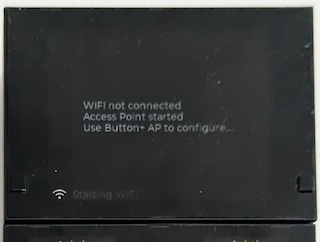

# Basic Configuration
{: .no_toc }

## Table of contents
{: .no_toc .text-delta }
- TOC
{:toc}

## Initial WiFi connection
Connecting your Button+ to a Wifi network is very easy. It takes only 5 logical steps: 
1. Make sure that the Button+ is in Access Point (AP) mode
2. Connect your phone to this Access Point
3. Configure the WiFi network

### Access Point mode
Your new Button+ will show that it is not connected:

### Connect your phone
**WARNING: Your phone disconnect from your currect wifi network. Make sure you save any unsaved work!**

Open the wifi access point selection screen on your phone, similar to how you would connect to a public hotspot. On an android phone, you can swipe from the top of your screen down. If you use IoS on an Apple iPhone or a different flavour of Androud, it looks different.

The screenshots in these steps are for a version of Android, but are similar to the screens on other operating systems.

In the list of available access points (Wifi networks) you will see the ‘Button+ AP’. If not, make sure your Button+ is still powered on and the initial message is visible. Select the Wi-Fi network ‘Button+ AP’. Depending on your brand/type of mobile phone, either a pop-up message will be displayed or a web browser will open. When you are sure you are connected but you don't see the WiFi selection screen, go to (http://172.217.28.1/_ac/config).

### Configure the Button+
A web page that will be opened, displays some technical information. In the upper right corner, you will see a hamburger menu-button. (See below.) Click on it.

Select the option ‘Configure new AP’:

A list of all available wifi- networks will be displayed. Select your network.

The field ‘SSID’ will be filled with the name of the selected network. Enther the Wi-Fi passphrase in the field below it. If you want to assign a fixed IP-address or configure other network parameters, uncheck the ‘Enable DHCP’ box. More fields will be listed. Configuring those parameters is beyond the scope of this document. Click on ‘Apply’. The Button+ will restart and show its IP on the display. You can now start with the fun part: configure the Button+!

In case your phone does not reconnect to your home network, you will have to do that manually. The Button+ will give a warning when something went wrong; you can restart the WiFi procedure.

## Configuring your Button+
In this chapter, the basics are discussed. Specific topics are listed in the [display](display_configuration.md) and [button](button_configuration.md) documentation. 
1. Firmware update
2. General Configuration
3. MQTT Broker configuration

In the lower left corner of your Button+ you will find the IP-address that is assigned to the device, either by a DHCP-server or as configured in the previous chapter.

Open a browser on your computer or mobile phone. In the address bar, type the IP-address and press enter.

A web page will open:

On the left, you see a live copy of what is displayed on the screen of the Button+. On the right, you see all configuration options. We will briefly discuss them one by one. To open a menu, click on the title.

Note: If you click on a menu item with a down-arrow, it will close other open menus and open a new one. If you click on a blue button with white text, it will open an submenu.

Before we will discuss each topic in the list from top to bottom, we will discuss the topic ‘Firmware’ first. We will upgrade your Button+ to the latest firmware version, so you can enjoy the latest features available. Note that the newest version might be at a higher level than discussed in this manual, so your screens and options will most likely look slightly different from the screenshots in this manual. This manual is based on firmware version 1.09, released in February 2024.

### Firmware
Click on the ‘Firmware’ button. Your firmware version might be different. Click on the button ‘Update Firmware’.

The update process will start. The ‘Update Firmware’ button will be greyed out. After a minute or so, the Button+ will restart and firmware version will be updated. During the update process, it is normal to see connection errors at the top of the configuration web page.

### General Settings
Configure the basics in this screen, such as the device name, location and accent color. There are 4 general topics you can configure (FW 1.11).
1. Page status, reports the page your Button+ shows (see xyz)
2. Page set topic, listens to page change commands (see xyz)
3. Brightness topic for the display (see [display documentation](display_configuration.md))
4. Brightness topic for the buttons (see [button documentation](button_configuration.md))

### MQTT Broker
It is essential to configure your Button+ to connect to your own MQTT broker. Open the `MQTT Brokers` menu and add a new broker. Fill in at least the Id and URL. Also add username and password if needed by the broker.

## Pages
Button+ suports basic page functionality as of firmware version 1.1. This means that you can assign display items to a page; they appear only when the page is active. You can switch pages with the two buttons on the main display itself. Left is back, right is forward. The pages id's are numeric.

